# Sestavení Raspberry Pi 3B+/4 kiosku
Tento dokument je návodem k sestavení kiosku za použití jednodeskového počítače Raspberry Pi a oficiálního Raspberry Pi 7" dotykového displeje.  

## Soupis materiálů
- Raspberry Pi 3B+ / Raspberry Pi 4
- Oficiální Raspberry Pi 7" dotykový displej.
- 2x propojovací kabel (měl by být obsažen v balení dotykového displeje) nebo externí Micro-USB zdroj 5 V napájení.
- 4x M2.5/6 mm šroubek (měl by být obsažen v balení dotykového displeje)
- 10 cm dlouhý 15žilný páskový kabel kompatibilní s RPi (měl by být obsažen v balení dotykového displeje)
- 4x Samec-Samice M3/6 mm, 34 mm dlouhé distanční sloupky (nepovinné, ohledně délky jsou ještě dodatečné informace [níže v dokumentu](#mechanické-sestavování-rpi-dotykového-displeje-a-případně-krabičky))
- 3D tiskárna, s alespoň 20 x 14 cm velkým beden (nepovinné)
- Ethernetový kabel (nepovinné)
- 4x M3 šroubky rozumné délky (nepovinné)
- napájení pro RPi

## 3D tištění krabice (nepovinné)  
> **Note**  
> Silně doporučujeme zvolit tento krok jako první, vzhledem k tomu že tisk trvá nějakou dobu a takhle může tiskárna pracovat, zatímco vy budete pokračovat v instalaci/stavbě.  

1. Stáhněte si STL soubor který chcete:  
    > **Warning**  
    > Wi-Fi bude fungovat i s klasickou verzí krabičky, ale ne naopak! Nestrčíte tam ethernetový kabel, neboť tam není díra.

    - [**Klasická verze**](models/rpi_kiosk_box.STL)
    - [**Wi-Fi verze**](models/rpi_kiosk_box_wifi.STL)
1. Vložte STL soubor do svého sliceru:  
    
    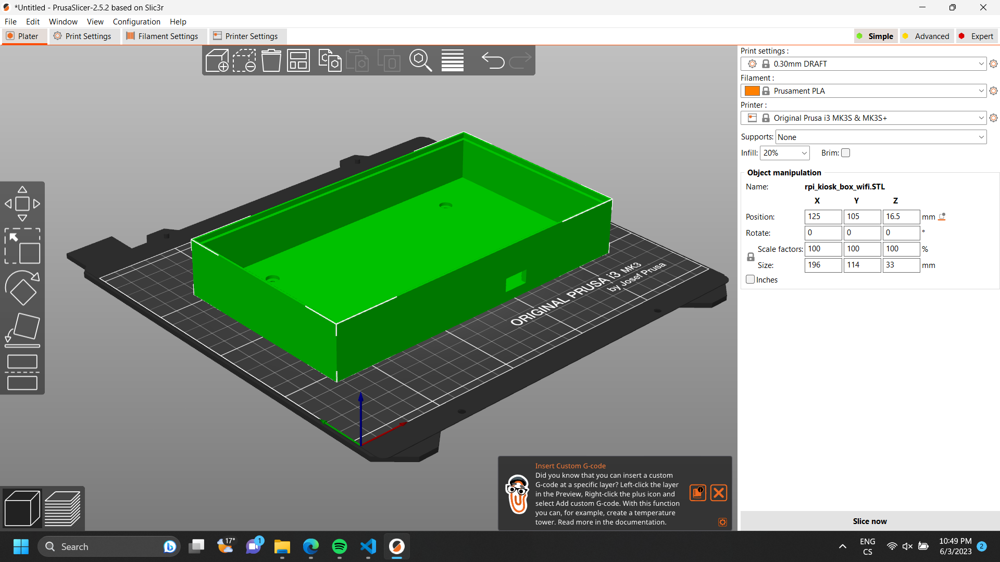
1. Naslicujte model a exportujte GCode pro svoji tiskárnu.
1. Nechte tisknout.

## Připojení displeje k RPi

1. Připojte napájení displeje za použití:
    - **2 propojovací kabely z RPi**

      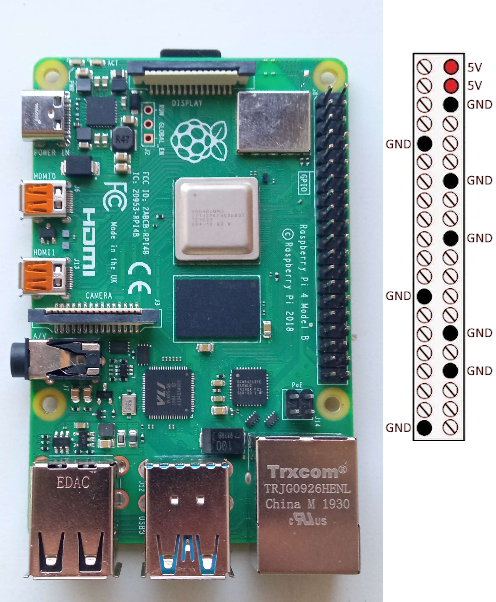

      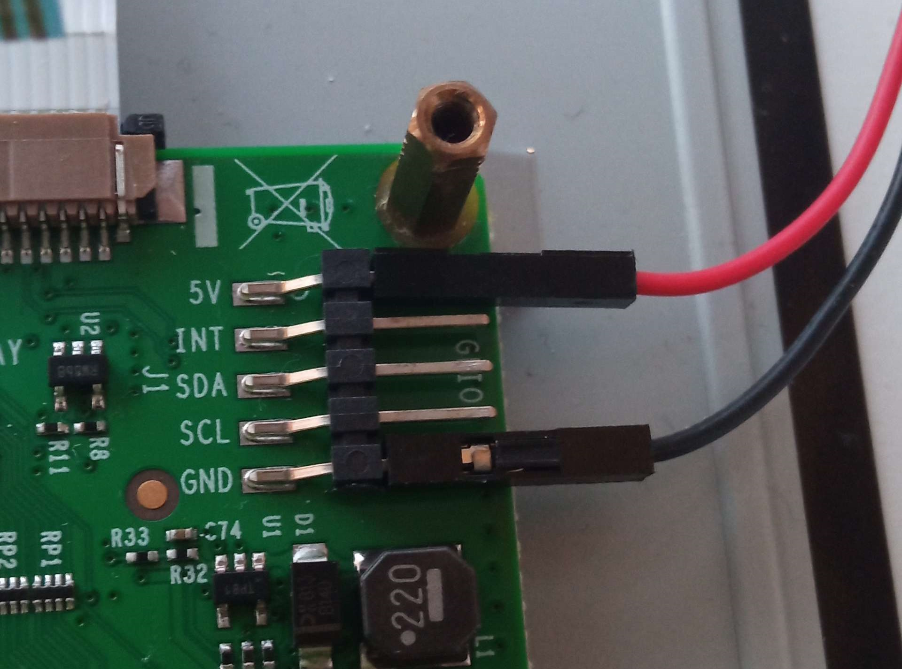

      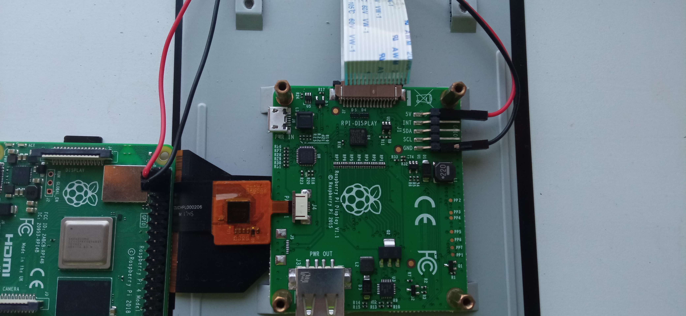  
    - **Externí Micro-USB zdroj 5V napájení.**

        > **Warning**  
        > Na Micro-USB kabel není krabička přizpůsobena, nedoporučujeme ho tedy použít.

      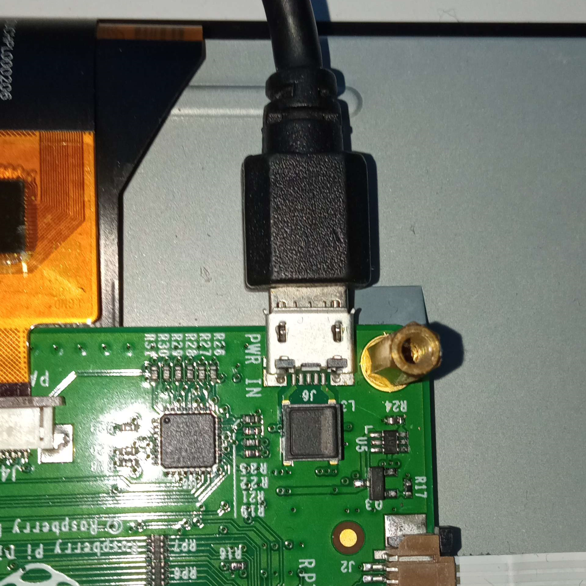
2. Připojte displej k RPi za použití páskového kabelu.
    > **Warning**  
    > Toto není další způsob připojení napájení pro displej, páskový kabel slouží k přenosu dat. (tzn. musíte připojit napájení **a zároveň** páskový kabel)  
    
    RPi by mělo být položeno portem pro displej nad portem na adaptéru dotykového displeje, takže se připojí jako je ukázáno na obrázku níže. (přirozeně, nezamotaně).

    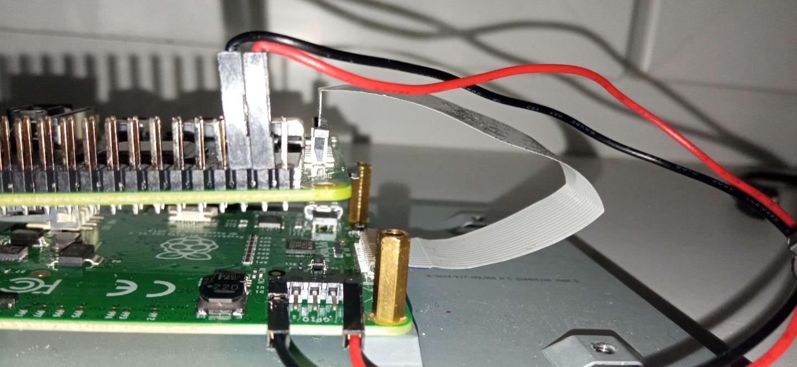

## Mechanické sestavování RPi, dotykového displeje (a případně krabičky)

>**Warning**  
> Kroky 2 až 5 jsou povinné jen pokud používáte naši krabičku.

1. Položte RPi na distanční sloupky adaptéru, a sešroubujte (4x M2.5/6mm).
    >**Warning**  
    > Buďte opatrní při práci se šroubovákem – hrozí nebezpečí poškození páskových kabelů propojující displej s RPi!

    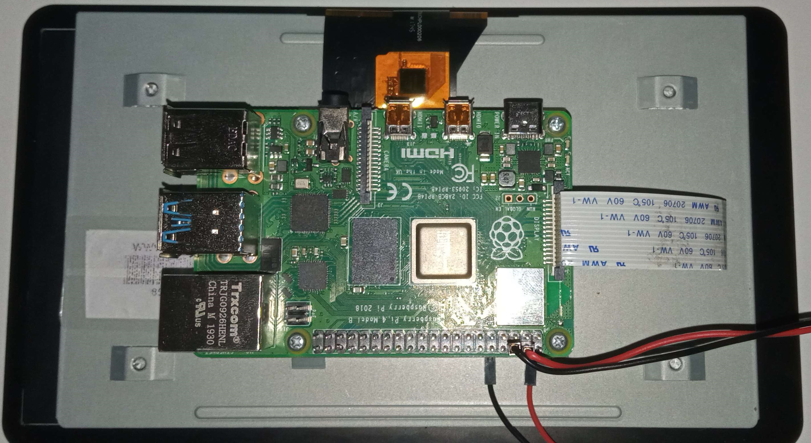

1. Prostrčte potřebné kabely dírkami v krabičce. (nepovinné)

    > **Warning**  
    > Pokud používáte RPi 4 (nebo jakýkoliv model napájený prostřednictvím konektoru USB typu C), může být tento krok složitější, neboť samotný USB-C konektor je přes 3cm dlouhý, takže se může stát (a pravděpodobně stane), že se Vám RPi nepodaří s připojeným konektorem do krabičky zasunout, a budete jej muset připojit až dodatečně.

    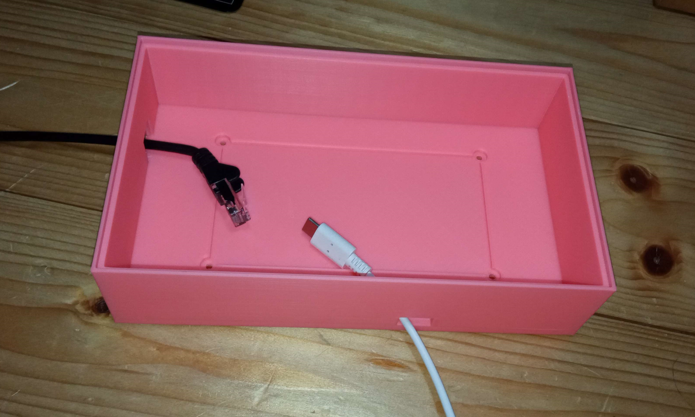

1. Zašroubujte distanční sloupky do děr na displeji. (nepovinné)

    > **Note**
    > Délka distančních sloupků se může lišit a vzhledem k tomu, že sehnat přesně dlouhé distanční sloupky může být náročné, toto je prostor pro Vaši improvizaci. Je však nutné se držet základních pravidel. Distanční sloupky nesmí být delší 34 mm, jinak se do krabice nevejdou. Když naopak používáte sloupky kratší (což je dost pravděpodobné), pamatujte, že šroubky na zadní straně krabice musí být dostatečně dlouhé, aby dosáhly na na distanční sloupky a bylo tak možné displej uchytit a zároveň by neměly příliš přesahovat záda krabice. (toho lze jednoduše dosáhnout použitím standardních [kovoobraběčských](https://cs.wikipedia.org/wiki/Piln%C3%ADk) nástrojů) Samozřejmě mějte na paměti, že čím kratší sloupky budou, tím menší podporu poskytnou pro displej.

    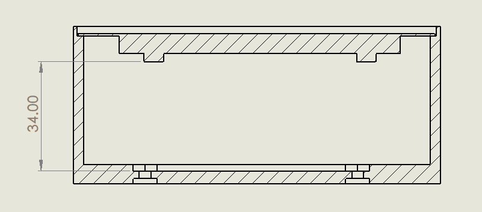

    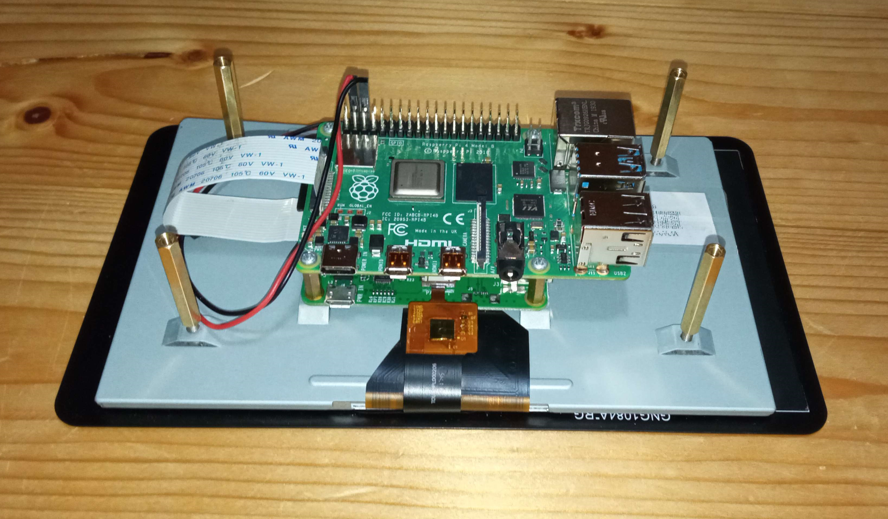

2. Připojte kabely k RPi a strčte ho do krabičky. (nepovinné)

    >**Warning**  
    > I pokud nepoužíváte naší krabici, zvažte zapojení ethernetového kabelu, jinak vám nemusí fungovat připojení k internetu.

    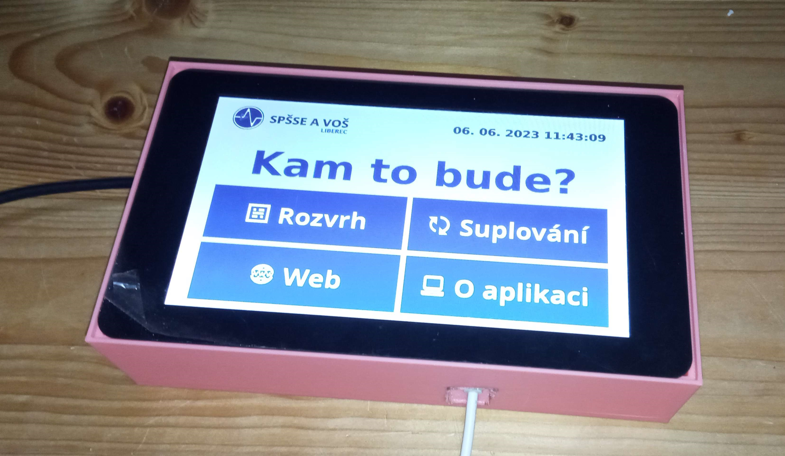

3. Použijte 4 M3 šroubky k zafixování zad krabice k distančním sloupkům. (nepovinné)

    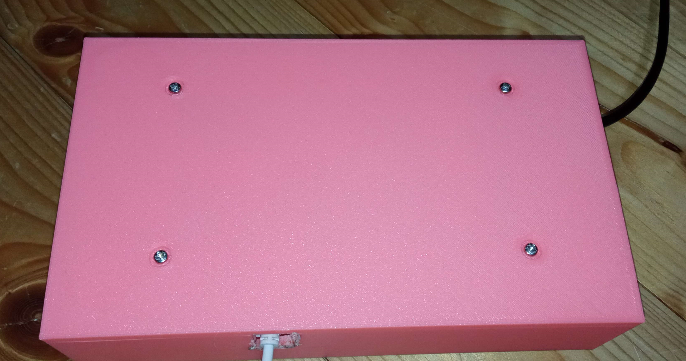