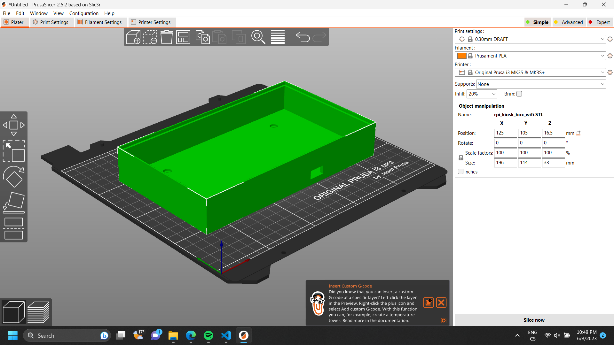
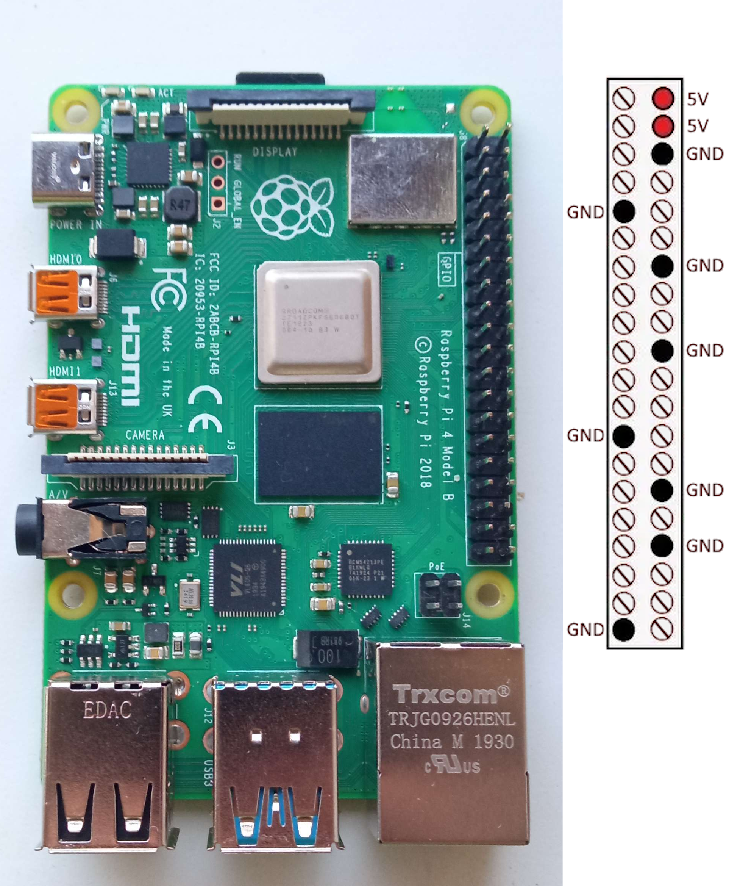
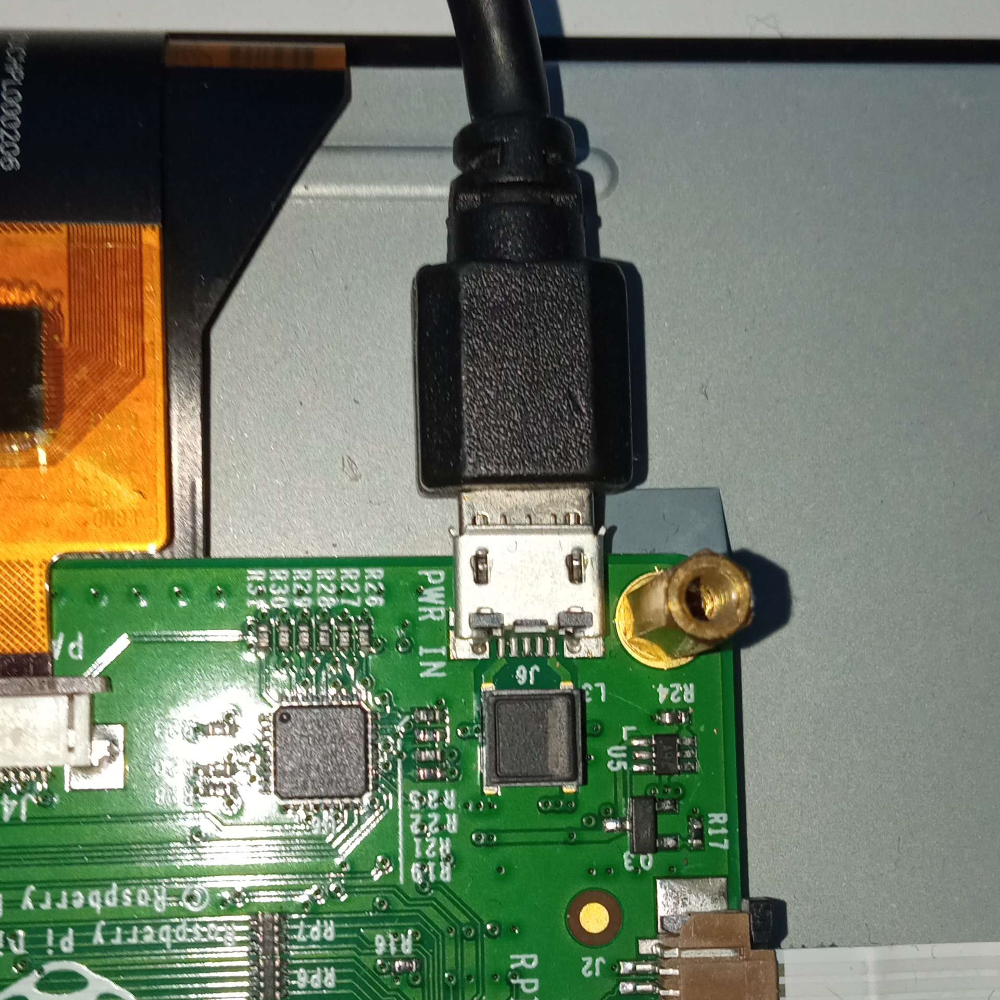
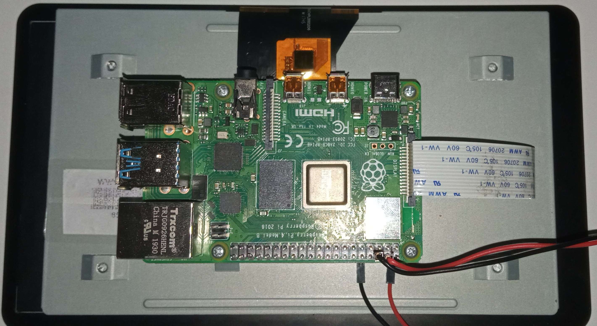
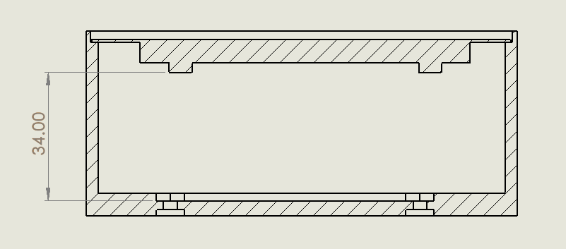
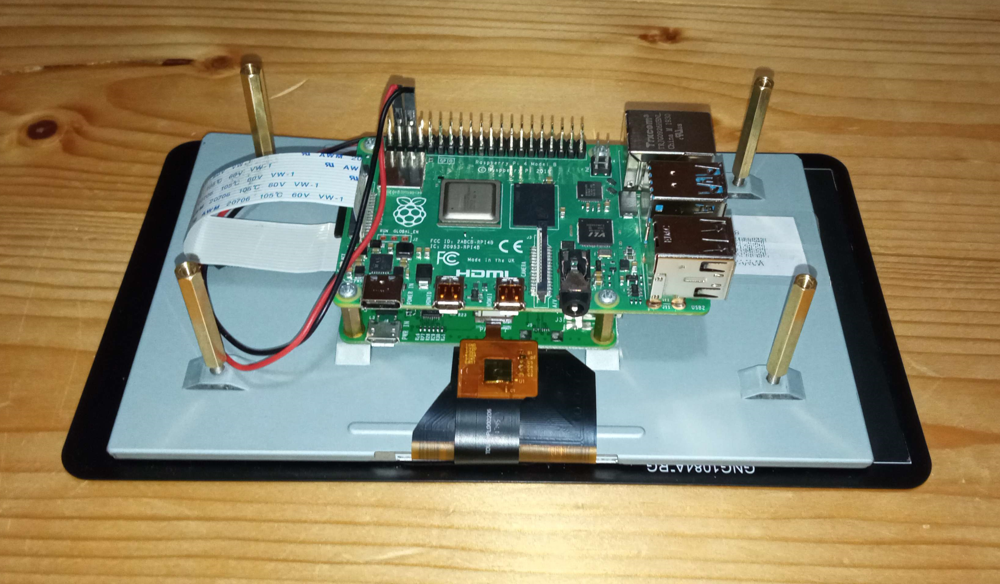
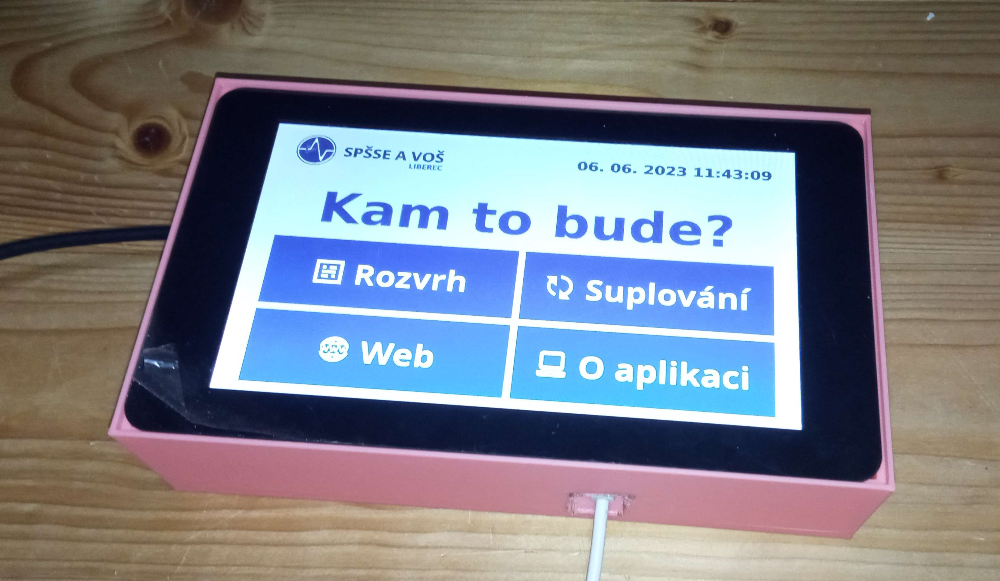
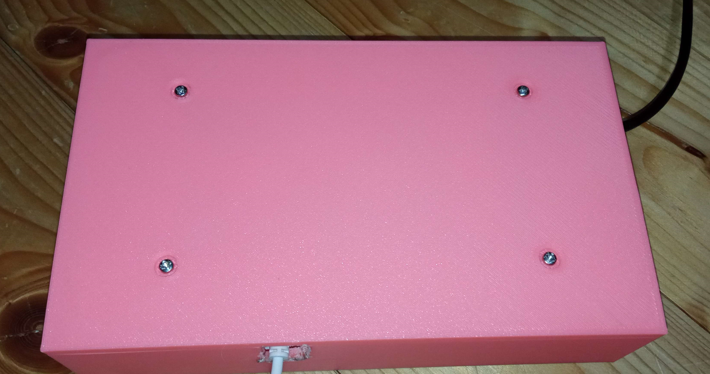

# Assembling the Raspberry Pi 3B+/4 Kiosk
This document is a guide on how to assemble the kiosk itself using Raspberry Pi single-board computers and the official Raspberry Pi 7" Touchscreen Display.  

## Bill of Materials
- Raspberry Pi 3B+ / Raspberry Pi 4
- Official Raspberry Pi 7" Touchscreen Display
- 2x jumper cables (should come with the touchscreen) or an external Micro-USB 5V power source
- 4x M2.5/6mm bolts (should come with the touchscreen)
- 10cm long 15-way ribbon cable compatible with RPi (should come with the touchscreen)
- 4x Male-Female M3/6mm, 34mm long standoffs (optional, for more information on the length, take a look [further in this document](#mechanically-assembling-the-rpi-the-touchscreen-and-optionally-the-box))
- 3D printer, with at least 20x14cm bed (optional)
- Ethernet cable (optional)
- 4x M3 bolts of rational length (optional)
- RPi power supply

## 3D Printing the Box (optional)  
> **Note**  
> We strongly recommend choosing this step as the first one, since the printing takes some time, and this way your printer can be running while you continue with another step.  

1. Download the STL file of your choice:  
    > **Warning**  
    > Wi-Fi will still work even with the classic version of the box, but not the other way around! You won't be able to stick the Ethernet cable inside the box since there is no hole for it.

    - [**Classic version**](models/rpi_kiosk_box.STL)
    - [**Wi-Fi version**](models/rpi_kiosk_box_wifi.STL)
1. Add the STL file to a slicer of choice:  
    
    
1. Slice the model and export the GCode for your printer.
1. Let it print.

## Hooking the Touchscreen up to the RPi

1. Hook up the power for the touchscreen using:
    - **2 jumper cables from RPi**

      

      

        
    - **External Micro-USB 5V power source**

        > **Warning**  
        > The box is not designed with external Micro-USB power in mind, therefore we do not recommend to use it.

      
2. Connect the display to the RPi using the ribbon cable
    > **Warning**  
    > This is not another way of hooking up the power! The (15-way) ribbon cable is used for data transfer (i.e. you need to hook up the power AND connect the display via ribbon cable).  
    
    The RPi should be placed with the display port being above the Touchscreen adaptor's one, so you just hook it up like shown in the picture below (naturally, not twisted anyhow).

    

## Mechanically assembling the RPi, the Touchscreen (and optionally the Box)

>**Warning**  
> Steps 2-5 are applicable only if using our box.

1. Place the RPi on top of the standoffs on the touchscreen, and screw it together (using the 4x M2.5/6mm).
    >**Warning**  
    > Be really careful when working with the screwdriver – you might damage the ribbon cables connecting the display to the RPi!

    

1. Stick the necessary cables through the holes in the box. (optional)

    > **Warning**  
    > When using RPi 4 (or anything using USB-C connector for power), this step might be very tricky, since the connector itself is about 3cm long, which means you might need to put it inside afterwards when the whole thing is assembled.

    

1. Insert the standoffs into the holes on the display. (optional)

    > **Note**  
    > The length of the standoffs may vary, and getting the accurately long ones might be a bit tricky, so this is a place for you to improvise. Just keep in mind that they must not be longer than 34mm because otherwise they will not fit in the box. Also when using shorter ones, mind that the bolts used to attach the electronics to the box from the back must be long enough to reach the standoffs, and also short enough to not stick from the back too much. (to achieve this you can use [standard tools](https://en.wikipedia.org/wiki/File_(tool)) And of course the shorter the standoffs are, the less support for the touchscreen will they provide.

    

    

2. Connect the cables to the RPi and fit it in the box. (optional)

    >**Warning**  
    >Even if not using our box, consider plugging the Ethernet cable in, or else your internet connection might not work.

    

3. Use 4 M3 bolts to fix the standoffs to the back of the box. (optional)

    